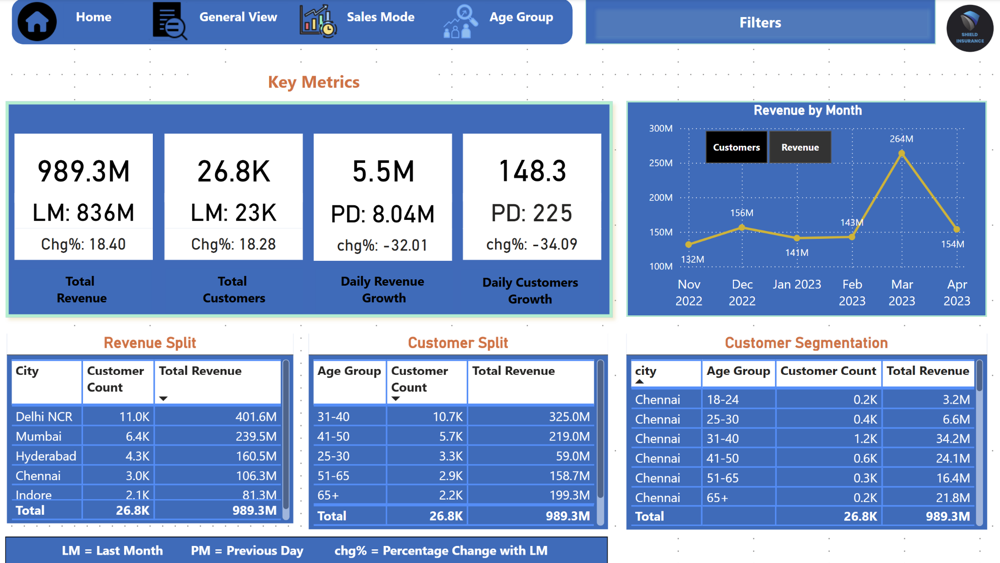
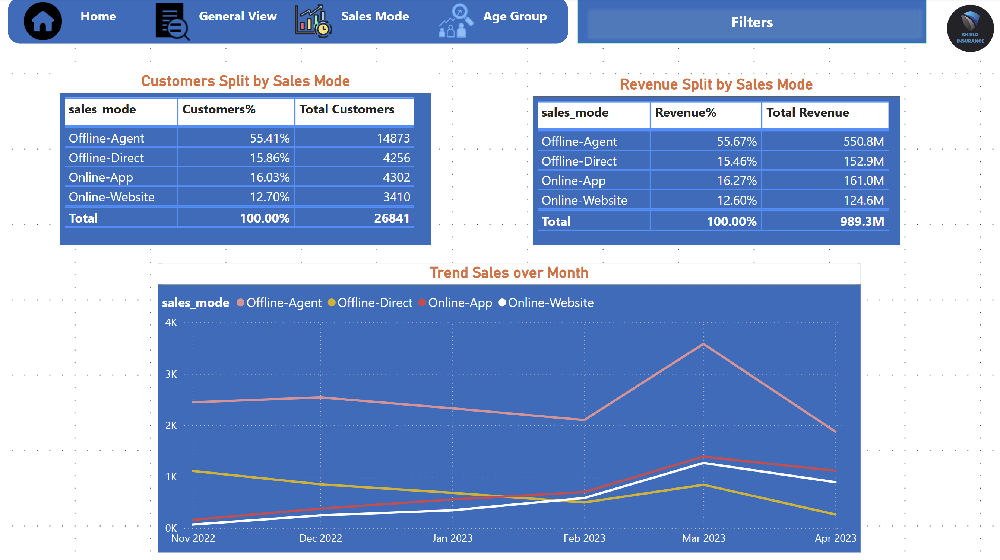

# 📊 Shield Insurance Dashboard – Power BI Project

## 🧭 Introduction

The **Shield Insurance Dashboard** is a data-driven Power BI solution built to help a leading insurance company in the Indian market monitor key performance indicators. The dashboard enables business users to analyze customer behavior, revenue trends, and policy performance with interactive and insightful visualizations.

---

## 🎯 Job Objective

To deliver an interactive, insight-driven Power BI dashboard that empowers business users at **Shield Insurance** to:

- **Track revenue and customer growth trends** with real-time and historical performance metrics  
- **Segment customer behavior** by **city**, **age group**, and **sales mode** for deeper demographic insights  
- **Identify opportunities** for **channel optimization** and **product strategy refinement** based on policy trends and sales analysis  
- **Enable daily and monthly performance monitoring** through dynamic KPIs and intuitive visual filters  

This project demonstrates my ability to turn complex datasets into actionable business intelligence—supporting informed decision-making and strategic planning.

---

## 🌟 Project Vision

This pilot project aims to help the business gain confidence in data-driven decisions and uncover valuable insights by:

- Understanding the **total number of customers** and **revenue generated**
- Tracking **daily revenue growth rate** and **daily customer growth rate**
- Monitoring **month-over-month changes in policies** to identify trends
- Segmenting customers by **age group** and analyzing metrics by **city**
- Creating a **toggle feature** to switch between revenue and customer trend graphs
- Using **filters** (sales mode, age group, city, month, policy ID) to enhance analysis
- Adding a dedicated **Sales Mode Analysis page** to break down customer acquisition channels
- Including an **Age Group Analysis page** to explore how age influences policy preference, sales mode, and expected settlement

---

## 📈 Key Insights

- 📊 **Revenue and Customer Growth**:  
  Shield Insurance generated **₹989.3M** in revenue with **18.4% MoM growth** and acquired **26.8K customers** (+18.28%).

- 📉 **Short-Term Dip**:  
  Daily metrics declined: **-32.01%** in daily revenue and **-34.09%** in customer acquisition, signaling short-term slowdown.

- 🏙️ **Top Regions**:  
  - **Delhi NCR** contributed the most: ₹401.6M (11K customers)  
  - Followed by **Mumbai** and **Hyderabad**  
  - These three cities accounted for ~80% of total revenue.

- 🧑‍🤝‍🧑 **Age Segment Impact**:  
  - **31–40 age group** led with ₹325M revenue and 10.7K customers  
  - **41–50** and **65+** groups showed strong revenue-to-customer ratios  
  - Youth (18–30) segments underperformed—indicating growth opportunity.

- 🌐 **Sales Channel Performance**:  
  - **Offline-Agent** dominated with **55%** of customers and ₹550.8M in revenue  
  - **Online channels** (App + Website) showed consistent growth post-Feb 2023  
  - Offline-Direct lagged behind in both revenue and engagement.

- 📅 **Monthly Trend Peak**:  
  - **March 2023** marked a peak across all KPIs with revenue hitting ₹264M  
  - Likely tied to a marketing campaign or seasonal spike.

---

## 🖼️ Dashboard Preview

### 🧭 Landing Page Summary  

### 📋 General View  

### 🛒 Sales View  

### 👥 Age Group Analysis  

---

## 🛠️ Key Features

✅ **Interactive KPI Cards** – Total revenue, customer count, daily growth rates  
✅ **Time-Series Analysis** – Monthly trends for customer and revenue growth  
✅ **Dynamic Filtering** – Slice data by city, age group, policy ID, and sales mode  
✅ **Customer Segmentation** – Visual breakdown by demographics and location  
✅ **Sales Channel Insights** – Understand performance across different modes  
✅ **Age Group Intelligence** – Link customer age to policy behavior and outcomes  
✅ **Modern, Clean Visual Design** – Built for clarity and ease of use

---

## 📂 Project Files

- `shield-insurance-dashboard.pbix` – Main Power BI file  
- `sample-data.xlsx` – Sample dataset used for analysis  
- `README.md` – Project documentation (this file)

---

## 🤝 Let’s Connect

Thank you for viewing this project! I welcome feedback, questions, or collaboration opportunities.  
Feel free to reach out if you'd like to discuss the dashboard or any related analytics work.

---
